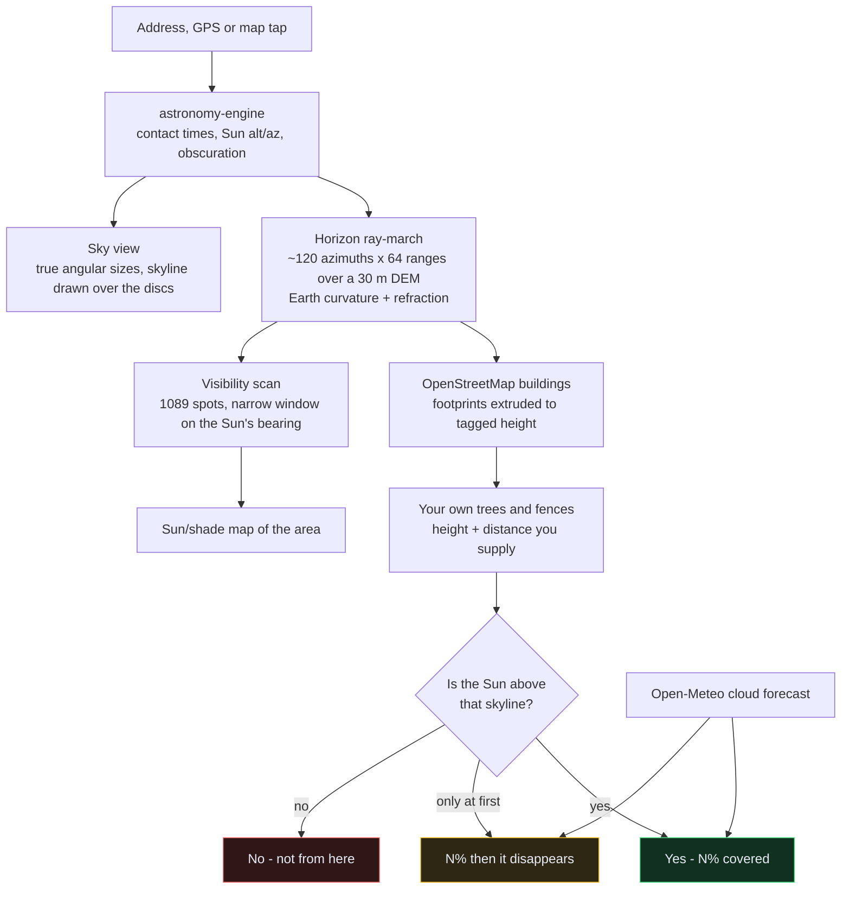

# Will I see the eclipse?

**Every eclipse site tells you the time and the percentage. None of them tell you
whether the hill, the terrace of houses or the tree in front of you is in the way.**

For the partial solar eclipse of **Wednesday 12 August 2026**, that is the only
question that matters. From the UK the Sun is between **19° and 2.7°** above the
horizon for the whole event — so low that an 8 m house 25 m away hides it
completely, and mature trees 40 m away block it by 8°. A hedge is fine. Knowing it
is "91% covered at 19:13" tells you almost nothing about whether *you* will see it.

Type your address. This ray-marches a 30 m elevation model plus OpenStreetMap
building heights along the real line to the Sun, and gives you a straight yes or
no — plus a simulation of the view and a map of where nearby you can see it.

Live at **[eclipse.hammantlabs.com](https://eclipse.hammantlabs.com)**. Everything
runs client-side: no backend, no API key, no accounts, no tracking.

## How it works



The load-bearing idea behind the map: **standing in direct sunlight is exactly
equivalent to having line of sight to the Sun.** So a sun/shade map at maximum
eclipse *is* a "can you see it from here" map for a whole area at once.

## Why the horizon matters this time

From the UK this eclipse happens low in the evening sky — the Sun is between
**19° and 2.7°** above the horizon throughout, and sets not long after. At those
angles a ridge, a terrace of houses or a line of trees to the west is the
difference between a spectacular view and nothing at all. Obscuration alone tells
you almost nothing.

So the tool combines three layers:

1. **Obscuration** — how much of the Sun is covered, from real ephemerides.
2. **Horizon clearance** — a ray-marched terrain profile *plus* extruded
   OpenStreetMap buildings, along the actual sightline.
3. **Cloud forecast** — hourly cover for the eclipse window.

## What it does

- **Local circumstances** — first contact, maximum and last contact in BST, with the
  Sun's altitude and compass bearing at each.
- **Sky clearance** — samples a 30 m digital elevation model along ~120 rays out to
  25 km, corrected for Earth curvature and atmospheric refraction, and reports how
  far above the real skyline the Sun sits at each stage.
- **Buildings** — OpenStreetMap footprints within 1.5 km, extruded to their tagged
  height (or storey count), merged into the skyline. In a city this dominates: at
  Bank in the City of London the terrain is flat and open, but 6,000-odd buildings
  put the Sun firmly behind a tower 76 m away.
- **Simulated view** — the true skyline with the Sun and Moon drawn at their correct
  altitude, azimuth and angular size. Zoom in for the crescent, or press play to
  watch the whole eclipse unfold. The skyline is painted over the discs, so when
  something hides the Sun you see exactly that — with a marker showing where it is.
- **Save video** — records the animation to a `.webm` you can share.
- **Best spot near me** — scans a grid of nearby locations, scores each on horizon
  clearance and cloud, and pins the winners.
- **Trees and houses** — presets (hedge, houses opposite, mature trees) plus height
  and distance sliders for whatever is actually in front of you. Trees appear in no
  open dataset and at 2–19° Sun altitude they usually decide the outcome, so the tool
  asks rather than silently assuming open ground. The assumed screen is drawn in a
  distinct colour so it never gets confused with measured terrain.
- **Shareable links** — the location lives in the URL (including your assumed
  screen), so any spot can be sent on.
- **3D map** — pitched terrain view with a sightline showing which way to look.

## What it actually tells you

Three real spots, same eclipse, same evening:

| Where | Verdict | Why |
|---|---|---|
| Open parkland, Alexandra Palace | **Yes — 91.3% covered** | Sun sits 4.1° above the skyline at maximum |
| A street at Bank, City of London | **No — not from here** | 6,352 mapped buildings; the Sun is behind a tower 76 m away |
| A valley 2.5 km east of Snowdon | **Maybe — it will be close** | Clear at maximum, then the mountain takes it: last contact −8.0° |

The same spot flips between those answers depending on what you tell it is in front
of you. From Alexandra Palace:

| What's in front of you | Clearance at maximum | Verdict |
|---|---|---|
| Nothing / open view | +4.1° | Yes |
| Fence or hedge (2 m at 8 m) | +4.1° | Yes |
| Houses opposite (8 m at 25 m) | −3.9° | Hidden |
| Mature trees (15 m at 40 m) | −8.0° | Hidden |

That table is the whole argument for the tool. At 10.5° Sun altitude, ordinary
suburban houses across a road are enough.

## Running it

```bash
npm install
npm run dev      # http://localhost:5173
npm run build    # production bundle into dist/
npm run typecheck
```

## Deploying

Live at **https://eclipse.hammantlabs.com** — a private S3 bucket behind a
CloudFront distribution, with an ACM certificate and a Route 53 alias record.

```bash
DIST_ID=<cloudfront-id> npm run deploy
```

`scripts/deploy.sh` builds, syncs to S3 and invalidates the CDN. Two cache
policies matter: hashed asset filenames are immutable and cached for a year,
while `index.html` is sent `max-age=0, must-revalidate` — without that a deploy
would never reach anyone who had already visited.

The bucket blocks all public access; CloudFront reaches it through an Origin
Access Control, and the bucket policy names that one distribution specifically.
The distribution runs on `PriceClass_100` (North America + Europe edges only),
which is the cheapest tier and matches a UK audience.

**Cost:** CloudFront's perpetual free tier covers 1 TB/month egress and 10M
requests, so realistic traffic costs nothing beyond the Route 53 hosted zone
(~$0.50/month) and pennies of S3 storage.

Building for a subpath instead (e.g. a GitHub Pages project site served from
`/<repo>/`) just needs `BASE_PATH=/<repo>/ npm run build`.

## Data sources

| Layer | Source | Notes |
|---|---|---|
| Ephemerides | [astronomy-engine](https://github.com/cosinekitty/astronomy) | MIT, runs in-browser |
| Elevation | [AWS Terrain Tiles](https://registry.opendata.aws/terrain-tiles/) | Terrarium-encoded SRTM, free, CORS-enabled |
| Basemap | [OpenFreeMap](https://openfreemap.org/) Liberty | No API key |
| Cloud forecast | [Open-Meteo](https://open-meteo.com/) | No API key |
| Place search | [Nominatim](https://nominatim.org/) | Please respect their usage policy |

## Accuracy and limitations

- Contact times and obscuration were cross-checked against an independent NOAA
  solar-position implementation and against published figures for London
  (91.3% computed vs 91.4% published).
- **The elevation model is bare terrain at ~30 m resolution**, with OSM buildings
  layered on top. **No dataset contains trees**, so the tool lets you describe them
  instead. They matter enormously: from London at maximum, houses 8 m tall across a
  25 m road already block the Sun (−3.9°), and mature trees at 40 m block it by 8°.
  A hedge, by contrast, leaves it clear. Treat a "clear" verdict as *the terrain and
  mapped buildings are not in the way* — then set the screen to match your spot.
- Building heights come from OSM `height` or `building:levels` tags; where both are
  missing an 8 m default is assumed, so low-rise areas may be slightly off.
- Cloud forecasts more than a couple of days out are indicative only.

## Eye safety

**There is no safe moment to look at this eclipse with the naked eye anywhere in the
UK.** It is partial everywhere here, so a sliver of uneclipsed photosphere remains
throughout — that sliver is ordinary direct sunlight and will damage your retina
without any sensation of pain. Use ISO 12312-2 eclipse glasses, a properly filtered
telescope or projection.

## Development notes

`maptest.html` is a standalone harness for verifying the map renders. It shims
`requestAnimationFrame` before MapLibre loads, because Chrome throttles rAF to zero
in hidden/background tabs, which stalls MapLibre's render loop — the map appears
blank in automated browser testing for that reason alone. The DEM loader avoids the
same class of problem by using `fetch` + `createImageBitmap` rather than ``.

## Licence

Code: [MIT](LICENSE) — do what you like with it.

The data is not mine and carries its own terms:

- Map and building data © [OpenStreetMap](https://www.openstreetmap.org/copyright)
  contributors, licensed [ODbL](https://opendatacommons.org/licenses/odbl/). If you
  reuse it, keep the attribution.
- Elevation from [AWS Terrain Tiles](https://registry.opendata.aws/terrain-tiles/)
  (SRTM and others; see their attribution requirements).
- Forecasts from [Open-Meteo](https://open-meteo.com/) (CC BY 4.0).
- Geocoding by [Nominatim](https://operations.osmfoundation.org/policies/nominatim/) —
  note their usage policy before pointing serious traffic at it.

## Contributing

Issues and pull requests welcome. The one rule that matters: **this tool must never
give a confident answer it hasn't earned.** If the data is missing, say so; if
something wasn't checked, say that too. Several of the worst bugs found during
development were cases where the app asserted something it did not know — a failed
tile read as sea level, a geocoded address treated as standing inside your own house.
Prefer "we don't know" over a plausible guess.

Run `npx tsc --noEmit` before pushing.
